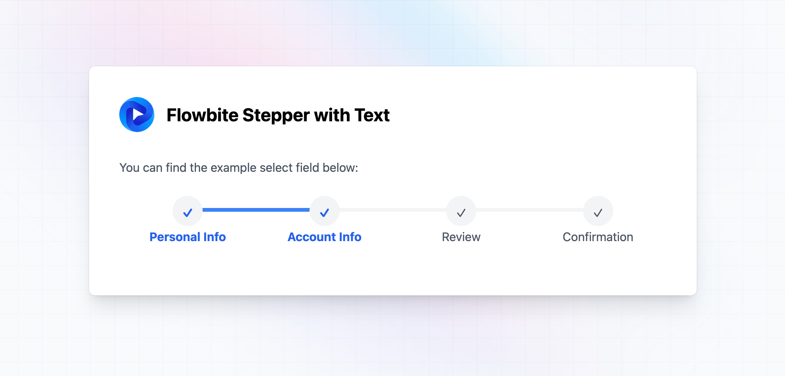

# Purpose of the Project
The [Flowbite](https://flowbite.com/) had different steppers but there was no horizontal stepper with texts that I can use for my project. So, I've created one and sharing it.

# Pre-Requisites
- This project is using [TailwindCSS](https://tailwindcss.com) like [Flowbite](https://flowbite.com/).

# How to Use
I have added the `style.css` file into the repo. If you copy and paste it into your project and include it in your html file you will be able to use the following ul tag to use the stepper.

```
<ul class="stepper">
    <li class="step step-done">
        Personal Info
    </li>
    <li class="step step-done">
        Account Info
    </li>
    <li class="step">
        Review
    </li>
    <li class="step step-done">
        Confirmation
    </li>
</ul>
```

# Example Image
